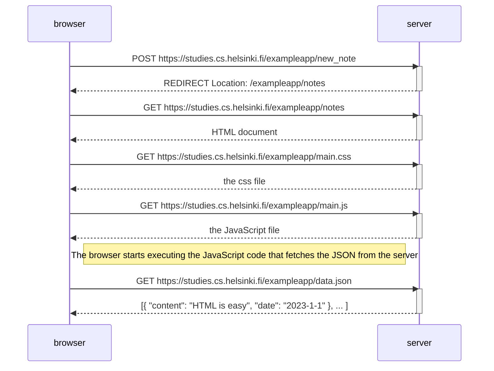

# Fundamentals of Web Apps
1.  Investigate the network tab of dev tools for this:
   https://studies.cs.helsinki.fi/exampleapp
2. *GET* is used between the browser and server to acquire the 2 components.

## Traditional Web Applications
 1. In a *traditional web application* like this one, the server serves either static text files formatted in html or can also form the html documents dynamically according to the application's code, using, for example, data from a database. The html code for this application has been created dynamically because it contains data about number of notes created.

It is created dynamically like this:
```javascript
const getFrontPageHtml = noteCount => {
  return `
    <!DOCTYPE html>
    <html>
      <head>
      </head>
      <body>
        <div class='container'>
          <h1>Full stack example app</h1>
          <p>number of notes created ${noteCount}</p>
          <a href='/notes'>notes</a>
          
        </div>
      </body>
    </html>
`
}

app.get('/', (req, res) => {
  const page = getFrontPageHtml(notes.length)
  res.send(page)
})
```

4. This writing of html code in between code is not good practice but was common in old school PHP programs. 

5. In traditional applications, the browser is dumb and only fetches HTML data from the server and all application logic is on the server. This server program can be created using something like **Java Spring, Python Flask, Ruby on Rails, Express library with Node.js.**

## Running app logic in the browsers
1. Browser immediately starts executing code once it grabs a script file after seeing a script tag in the html body.
2. `xhtmlHttpRequest()` object is used in an example to make requests to the server. This is like `fetch()`

## Event Handlers and Callback functions

```js
var xhttp = new XMLHttpRequest() //1

xhttp.onreadystatechange = function() {// 2
  // code that takes care of the server response
}

xhttp.open('GET', '/data.json', true)// 3
xhttp.send()
```
Request to the server is sent later and is handled before. What is going on?

1. On line 2, an event handler for the event *onreadystatechange* is defined for the object `xhttp` object doing the request. When the state of the object changes, the browser calls the event handler function. 

Then,
```js
xhttp.onreadystatechange = function() {
  if (this.readyState == 4 && this.status == 200) {
    // code that takes care of the server response
  }
}
```
The function checks the `readyState` equals for 4 and the http status code of the response is 200.

2. Event handler functions are also called callback functions.
3. The browser invokes these functions at the appropriate time when an event has occurred.

## DOM
The functioning of the browser is based on the idea of depicting HTML elements as a tree.

Document Object Model, or [DOM](https://en.wikipedia.org/wiki/Document_Object_Model), is an Application Programming Interface (_API_) that enables programmatic modification of the _element trees_ corresponding to web pages.

#### Manipulating the DOM from the console.

## Loading a page containing javascript full map
![[Pasted image 20251216020325.png]]


## Forms and HTTP POST
1. The Form tag has attributes _action_ and _method_, which define that submitting the form is done as an HTTP POST request to the address _new_note_.
![[Pasted image 20251216024136.png]]

2. The code on the server responsible for the POST request is quite simple (NB: this code is on the server, and not on the JavaScript code fetched by the browser):

```js
app.post('/new_note', (req, res) => {
  notes.push({
    content: req.body.note,
    date: new Date(),
  })

  return res.redirect('/notes')
})
```


## AJAX
1. The notes page of the example application follows an early 90s style of web dev and uses ajax. 
2. AJAX = Asynchronous Javascript and XML. a new revolutionary approach that enabled the fetching of content to web pages using JavaScript included within the HTML, without the need to rerender the page.
3. The traditional web app example (not the notes one) was an example of how all html content was generated by the html code generated by the server. 
4. With AJAX javascript could be embedded in the html content and could be loaded without having to rerender the whole page.

5. The application URLs reflect the old, carefree times. JSON data is fetched from the URL [https://studies.cs.helsinki.fi/exampleapp/data.json](https://studies.cs.helsinki.fi/exampleapp/data.json) and new notes are sent to the URL [https://studies.cs.helsinki.fi/exampleapp/new_note](https://studies.cs.helsinki.fi/exampleapp/new_note). Nowadays URLs like these would not be considered acceptable, as they don't follow the generally acknowledged conventions of [RESTful](https://en.wikipedia.org/wiki/Representational_state_transfer#Applied_to_web_services) APIs

6. The thing termed AJAX is now so commonplace that it's taken for granted. The term has faded into oblivion, and the new generation has not even heard of it.

## Single page app
1. Basically not many pages. One html page and the contents are changed using code that runs in browser and in the server. No frequent reloading of the page. This provides a more mobile app like UI/UX. 

2. Uses AJAX way of doing things (see what this means later). Instead of sending stuff through forms like in the notes app.

3. Now let's see the SPA version of the same notes app:
	https://studies.cs.helsinki.fi/exampleapp/spa
	- HTML looks almost the same except the form area
	![[Pasted image 20251216163419.png]]
	- No action and method on the form tag.

	- Looking at the network tab, we see that only 1 request is sent with the content type as json
	  ![[Pasted image 20251216164023.png]]
	- Also after sending, the server like before does not respond with a redirect, the browser stays on the same page and it sends no further HTTP requests.


`How does the new spa ahieve everything in a different way???`

4. Here is a snippet from the script that server sends at initial loading:
```js
var form = document.getElementById('notes_form')
form.onsubmit = function(e) {
  e.preventDefault()

  var note = {
    content: e.target.elements[0].value,
    date: new Date(),
  }

  notes.push(note)
  e.target.elements[0].value = ''
  redrawNotes()
  sendToServer(note)
}
```

5. The event handler for submission immediately calls `preventDefault()` to stop it from default behaviors and in turn, causing another GET.

6. Then the event handler creates a new note, adds it to the notes list and rerenders the list, and then sends the new note to the server.

7. The function to send the new note to the server:
	```js
var sendToServer = function(note) {
  var xhttpForPost = new XMLHttpRequest()
  // ...

  xhttpForPost.open('POST', '/new_note_spa', true)
  xhttpForPost.setRequestHeader('Content-type', 'application/json')
  xhttpForPost.send(JSON.stringify(note))
}
```

8. XMLHttp is not exclusively for XML data transfer. It was started like that and so the name persisted but now it is used for HTML, JSON and other data transfers.


## Javascript Libs

1. All of the code seen so far is just vanilla JavaScript
2. Many javascript libraries also exist to extend these functionalities or make interacting with this DOM-API easier compared to directly doing it.
3. One example is **JQuery**.

>[!important] What is jQuery?
jQuery is a fast, small, and feature-rich JavaScript library. It makes things like HTML document traversal and manipulation, event handling, animation, and Ajax much simpler with an easy-to-use API that works across a multitude of browsers. With a combination of versatility and extensibility, jQuery has changed the way that millions of people write JavaScript.

4. JQuery gained popularity because of its cross browser compatibility but now its use is not justified because of how all browsers support basic javascript features.

5. With the rise of SPAs, other libraries gained popularity as well, such as google's Angular.
6. Currently the most popular tool for implementing the browser - side of logic of web apps is Facebook's React library. It is often used with the **Redux** library.
7. Recently a newcomer, VueJS has also caught interest.

### Javascript Fatigue is coming for you!


Exercise 0.4: Define the sequence for the traditional non spa 



